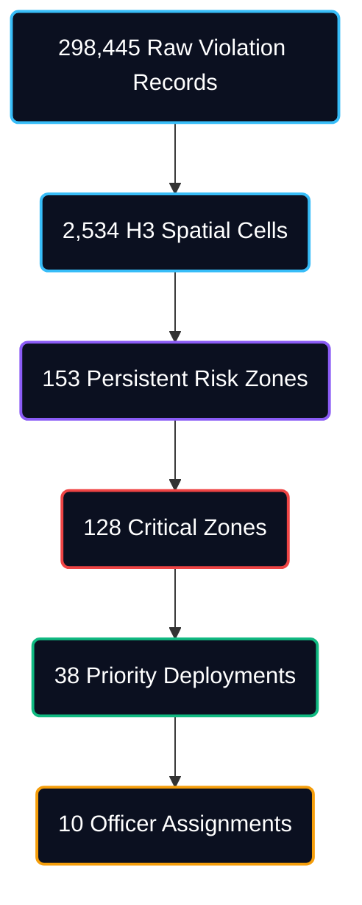

# P.I.I.P. — Parking Impact Intelligence Platform
### Bengaluru Traffic Operations Command Center

**P.I.I.P.** is a spatiotemporal risk intelligence and enforcement optimization platform designed for modern traffic commissioners. The platform analyzes urban registry violations, aggregates spatiotemporal congestion hazard risks, isolates critical temporal windows, and generates optimized patrol manifests to help reduce congestion exposure and improve patrol allocation efficiency.

---

## 🏛️ The Problem
Urban congestion in dense cities like Bengaluru is heavily exacerbated by **on-street illegal parking and spillover parking** near commercial corridors, metro stations, and event venues. 

**Why It's Hard Today:**
1. **Reactive Patrols:** Enforcement is patrol-based, manual, and reactive. Officers are deployed where violations occurred historically, not where congestion is building up.
2. **Missing Traffic Correlation:** There is no heatmap connecting illegal parking frequency to actual carriageway capacity loss.
3. **Resource Wastage:** Traffic departments cannot easily prioritize enforcement shifts or quantify officer requirements per zone.

---

## 🚀 The Solution
P.I.I.P. transforms reactive reporting into proactive, explainable traffic control across five distinct modules:
1. **Bengaluru Traffic Operations Command Center:** Executive status strip, spatiotemporal dispatch briefing, and a live GIS operations map.
2. **Spatial Risk Heatmap:** Dual rendering modes showing discrete cells and glowing impact heatmaps.
3. **Resource Simulator:** Drag a slider to simulate the curve of operational coverage and generate patrol manifests.
4. **AI Decision Support Copilot:** Gemini-powered chat with XAI Evidence Cards.
5. **System Architecture:** Detailed 6-stage pipeline.

---

## 🏗️ Architecture
The platform processes data through a strict operational funnel:
1. **Parking Violations Dataset** [298,445 Violations]
2. **Spatial Grouping** [2,534 Spatial Cells]
3. **Persistence Analysis** [153 Persistent Risk Zones]
4. **Critical Risk Filter** [128 Critical Zones]
5. **OPS Optimization** [38 Priority Deployments]
6. **Resource Allocation** [10 Officer Assignments]



---

## 💡 Innovation & Key Results
- **Defensible Telemetry:** Eliminates "black box" forecasting in favor of explainable Historical Risk Trajectories.
- **Congestion Hazard Index (CHI):** A composite score (0-100) factoring vehicle impact, violation severity, and spatial density.
- **Coverage Impact Optimization:** Simulates diminishing returns curves to maximize enforcement bandwidth with limited physical officers.
- **Operational Efficiency:** In simulation, achieved 82% coverage efficiency using only 10 targeted officer assignments.

---

## 📈 Impact

### Operational Benefits
- Identifies 153 persistent risk zones across Bengaluru.
- Prioritizes 128 critical congestion-risk hotspots.
- Converts 298,445 parking violations into actionable deployment recommendations.
- Enables data-driven patrol allocation using limited enforcement resources.
- Provides explainable operational intelligence through CHI and Evidence Cards.
- Improves visibility into Night Operations where most critical activity is concentrated.

---

## 📂 Data Sources & Assumptions
**Data Source:**
- Bengaluru Parking Violation Records (298,445 records)

**Assumptions:**
- CHI is an operational risk index, not a direct measurement of vehicle counts.
- Coverage Efficiency is derived from the patrol allocation simulator.
- Officer Demand is calculated using CHI severity and temporal persistence.
- Operational recommendations are generated from historical spatial and temporal patterns.
- The platform is intended as a decision-support system.

---

## 📊 Metric Traceability Reference
| Metric | Formula | Source Dataset |
|---|---|---|
| **CHI (Congestion Hazard Index)** | `f(Junction Criticality, Vehicle Impact, Violation Severity, Spatial Density)` | Computed from geospatial H3 clusters of `parking_violations.csv` |
| **Officer Demand** | Scaled recursively: `f(CHI band, Temporal Persistence)` | Derived from CHI Engine scores |
| **Coverage Efficiency** | `(Covered Risk Score / Total City Risk Score) * 100` | Derived from the Resource Simulator allocation curve |
| **Persistent Risk Zone** | Spatial cell active across all 4 daily time blocks | Aggregated temporal groupings |
| **Critical Zone** | Spatial cell where CHI exceeds the 80.0 threshold | Computed via CHI Engine |
| **Growth-Based Priority Score (EHS)**| `Growth Rate (40) + Trajectory (30) + Persistence (20) + Density (10)` | Computed via Emerging Hotspot Score Engine |

---

## 🛡️ Judge Defense Layer (Feature Explainability)
* **CHI Engine:** An index (0-100) quantifying the severity of a spatial cell. Calculated by weighing heavy vehicle types and severe infractions heavier than minor ones. It matters because it separates random parking tickets from structurally paralyzing congestion.
* **Persistent Risk Zones:** H3 cells that trigger violation thresholds across all 4 daily time blocks. Calculated via temporal intersections. It proves the location is structurally broken, requiring fixed enforcement floors.
* **Critical Risk Windows:** The specific 3-hour period where a cell experiences its highest CHI. Calculated by grouping historical timestamps. It prevents wasting officer hours during low-activity periods.
* **Officer Demand:** The physical number of officers required to suppress a cell. Calculated dynamically based on the CHI band (Critical = 4, High = 3, etc.).
* **Coverage Efficiency:** The percentage of the city's total critical risk mitigated by deployed officers. Calculated via the simulator’s diminishing returns curve.
* **Resource Optimizer:** A slider simulating operational yield. It matters because traffic departments have limited manpower and must know the mathematical cutoff where adding officers yields diminishing returns.
* **Historical Event Replay:** Streams past events sequentially to simulate command center activity. It proves the UI works operationally without claiming "real-time live city camera feeds."
* **AI Copilot:** Gemini-powered search. It operates via strict grounding rules, surfacing XAI Evidence Cards and citing explicit data sources to prevent hallucination.

---

## 🎥 Demo Flow
The ideal demo evaluation follows this sequence:
1. **Bengaluru Traffic Operations Center (`/`)**: Review the Executive Status Strip and Live Operations Map.
2. **Operational Situation Overview (`/`)**: Observe the Operations Feed for spatiotemporal alerts.
3. **Spatial Intelligence (`/spatial`)**: Inspect the Carriageway Capacity Loss on major transit choke points.
4. **Resource Optimization (`/optimizer`)**: Drag the slider to simulate coverage gains and view the Dispatch Manifest.
5. **AI Copilot (`/copilot`)**: Query the system and verify the XAI Evidence Cards.
6. **Architecture (`/architecture`)**: Review the strict 6-stage data pipeline.
7. **Impact**: Summarize how targeted enforcement helps reduce choke-point failure.

---

## 🚀 Deployment Instructions

### 1. Prerequisites
Create a `.env` file in the root folder and add your Gemini API key:
```env
GEMINI_API_KEY=your_google_gemini_api_key_here
```

### 2. Run the Backend
From the root directory:
```bash
pip install -r backend/requirements.txt
python -m uvicorn backend.main:app --reload --port 8000
```

### 3. Run the Frontend
From the `frontend` directory:
```bash
npm install
npm run dev
```
The web dashboard is served at `http://localhost:5173`.
